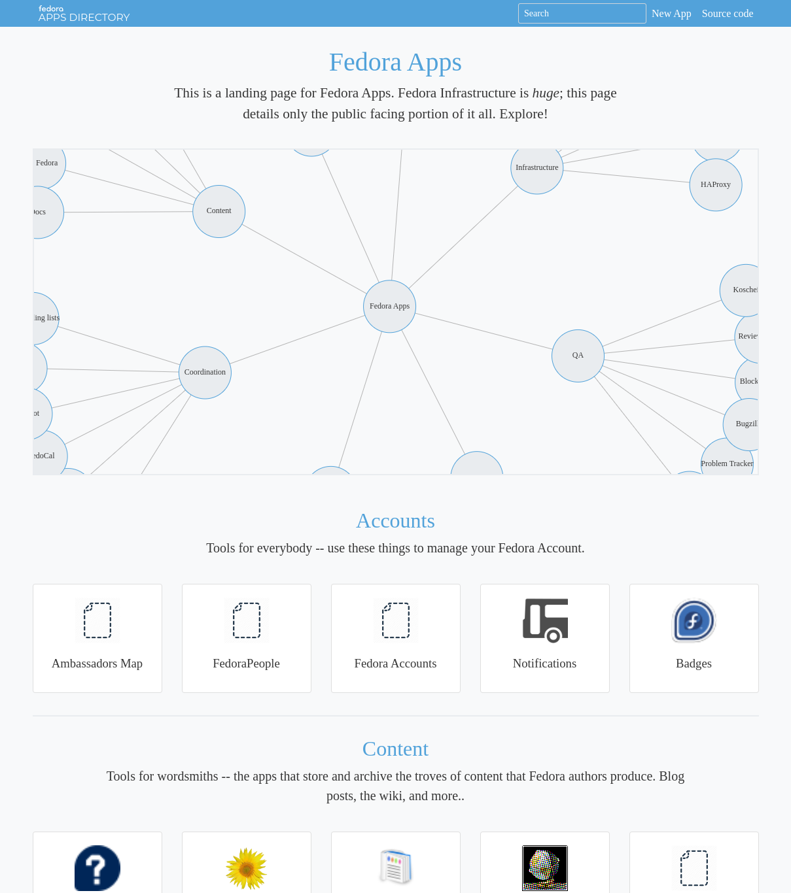

# Fedora Apps (unofficial)

https://fedora-apps.netlify.app/

I am trying to rewrite the Fedora Apps page
https://apps.fedoraproject.org in [Elm][elm]

Will it ever be deployed? We shall see.

## Why Elm?

I greatly appreciate the fact that a majority of Fedora infrastructure
is written using the same language - python. As a consequence we can
share code, everybody is able to contribute to any project without
difficulty, etc. The last thing I want to do is create a precedent
for writing Fedora Infrastructure applications in different languages
and ultimately shattering our python uniformity. So if this page
never gets officially deployed because of the programming language
choice, I respect that.

At the same time, functional programming enthusiasts and aficionados
doesn't have (almost) any project within Fedora they could join, hone
their skills and work on something useful at the same time.

This could be such a place.

## Deployment

This page is not (yet) deployed within Fedora infrastructure nor it is
maintained by the Fedora Infrastructure team. An unofficial demo is
deployed via [netlify.app][netlify-app]:

https://fedora-apps.netlify.app/

## Disabled Javascript

The Elm language is compiled into Javascript, and this project is
entirely written in Elm, without a single line of HTML. As a
consequence, if you have Javascript disabled in your web browser, only
a blank page is rendered.

There are ways how to make the page usable even with disabled
Javascript, so this limitation is only temporary.

https://malv.in/posts/2020-07-04-rendering-elm-to-static-html-with-selenium.html

## Missing application?

To avoid defining applications in multiple places, we simply
fetch [apps.yaml][apps-yaml] from the original
[fedora-infra/apps.fp.o][appsfpo-github] project.

Please follow their instructions to add a new application.

The sync to this project is not automatized so please ping me to do
it manually.

[elm]: https://elm-lang.org/
[apps-yaml]: https://github.com/fedora-infra/apps.fp.o/blob/develop/data/apps.yaml
[appsfpo-github]: https://github.com/fedora-infra/apps.fp.o
[netlify-app]: https://netlify.app/
